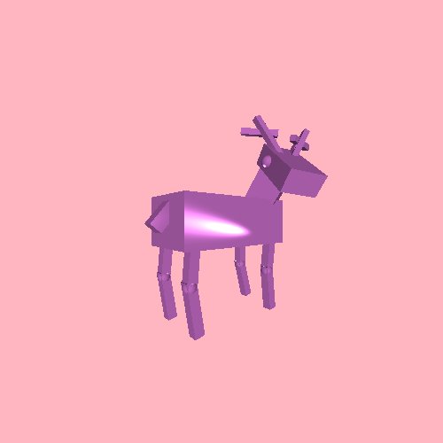
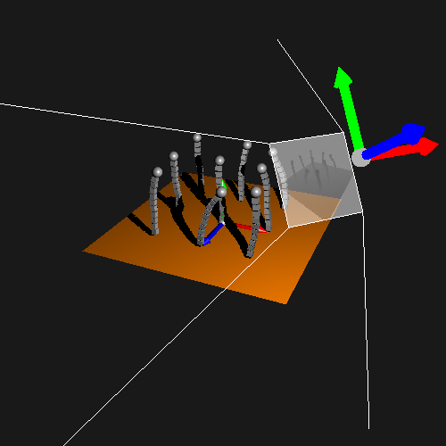

# COMP 557: Computer Graphics  
This repository is used for [COMP 557: Fundementals of Computer Graphics](https://www.mcgill.ca/study/2020-2021/courses/comp-557) provided by McGill University in Fall 2020. All assignments will be published AFTER submission deadline.  

## Assignments  
Note: Assignments will only be published AFTER submission deadline.  
1. [Assignment 1: Transform Hierarchy for an Animated Character](./src/comp557/a1)  
>   
> Results: see video [here](./data/a1data/yao_the_deer_pengnan.mp4)  
2. [Assignment 2: ArcBall and Shadow Maps](./src/comp557/a2)  
>   
> Released on 27 Oct. 2020  
3. [Assignment 3: The Utah Teapot](./src/comp557/a3/)  
> Wired bug to be fixed: caused by intervention between a1/a2/a3.  
> Released on 11 Oct. 2020  

## License  
This repository is under the MIT License.  
